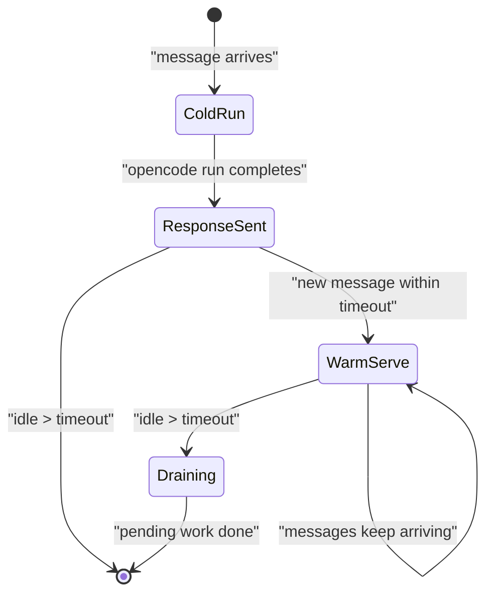
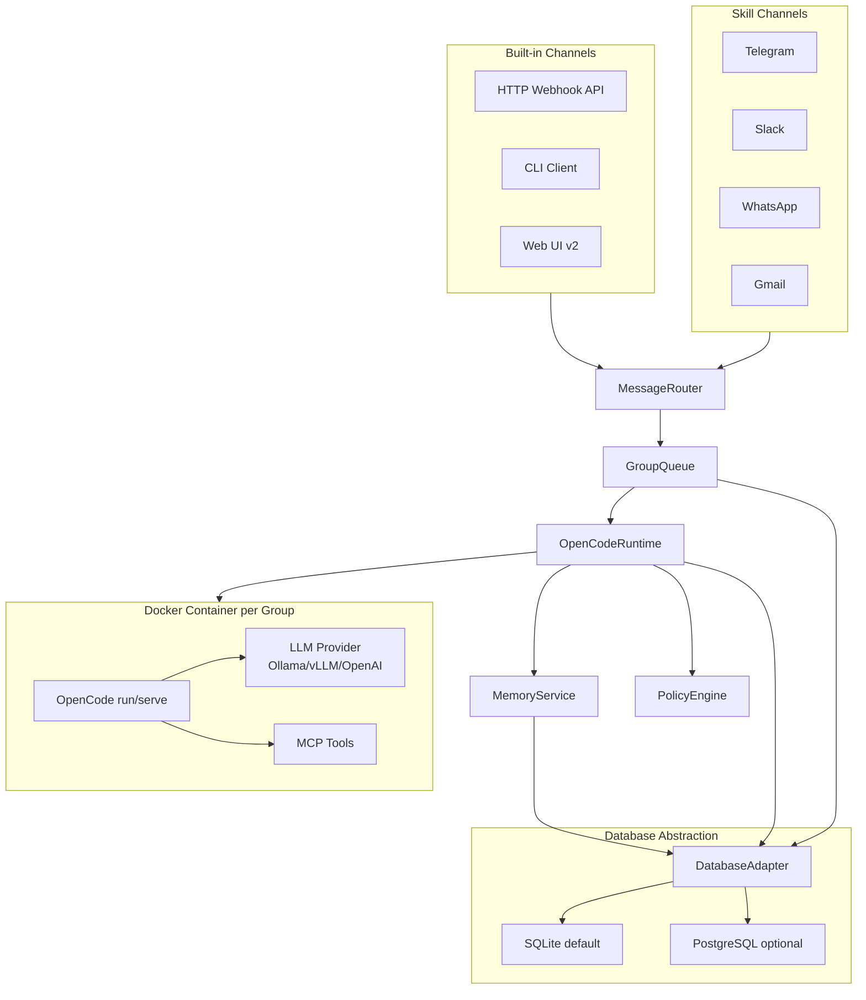

# Plan: Manaclaw Architecture And Scope

## Comparative Architecture Analysis: OpenClaw / NanoClaw / Memoh / ManaClaw

### Summary Matrix

**Core Runtime**

- OpenClaw: Node.js Gateway, single long-lived process, WebSocket control plane, Pi agent runtime (RPC). ~500K LoC.
- NanoClaw: Node.js single process, polling loop over SQLite, spawns containers with Claude Agent SDK. ~2K LoC core.
- Memoh: Go server + Bun Agent Gateway + Vue Web UI, PostgreSQL + Qdrant, containerd workspace per bot. ~30K LoC (estimated Go+TS+Vue).
- ManaClaw: TypeScript host orchestrator (from NanoClaw), spawns OpenCode runtime inside container sandbox, DB abstraction (SQLite default / PostgreSQL optional). Target ~3-5K LoC host. **Terminology: NanoClaw "group" is renamed to "workspace" in ManaClaw** -- each registered conversation context with isolated folder, container, session, tasks, memory.

**Model Abstraction**

- OpenClaw: Multi-provider (Anthropic, OpenAI, xAI, Ollama, local), explicit Ollama native API integration, model discovery, failover.
- NanoClaw: Anthropic-only (Claude Agent SDK). Local models only as MCP tools, not primary inference.
- Memoh: OpenAI-compatible + Anthropic + Google via Twilight AI SDK (Go). Per-bot model assignment for chat, memory, and embedding.
- ManaClaw: OpenCode as primary runtime; 75+ providers via Models.dev, OpenAI-compatible as transport contract for Ollama/vLLM. Per-group model routing.

**Agent Architecture**

- OpenClaw: Brain (LLM) + Hands (exec) in-process, skills as YAML+Markdown, heartbeat loop.
- NanoClaw: Agent runner inside container (Claude Code), streaming output markers, IPC via filesystem.
- Memoh: In-process Twilight AI agent loop, tool providers, subagents, conversation flow with loop detection.
- ManaClaw: OpenCode serve/run inside container, MCP tools, project-scoped agents (build/plan/custom), manaclaw orchestrator on host for routing/queue/policy/memory.

**Container Isolation**

- OpenClaw: None by default. Optional Docker sandbox configurable per-agent but not mandatory.
- NanoClaw: Mandatory. Docker or Apple Container. Each group gets own container with mounted workspace. Credential proxy shields secrets.
- Memoh: Mandatory. containerd with CNI networking. Per-bot container. gRPC bridge over UDS. Container snapshots for save/restore.
- ManaClaw: Mandatory. Docker. Per-group container with OpenCode inside. Read-only project mount, writeable workspace, policy-controlled mounts/egress.

**Memory System**

- OpenClaw: Markdown files in `~/.openclaw/memory/`. Hybrid search: BM25 + vector embeddings (local/openai/gemini/ollama). Optional QMD sidecar. Session memory experimental.
- NanoClaw: Hierarchical CLAUDE.md files (global + per-group). No embeddings, no semantic search. Session persistence via Claude session IDs.
- Memoh: Multi-provider (Built-in sparse/dense + Mem0 + OpenViking). LLM-driven fact extraction, hybrid retrieval (dense + BM25 + neural sparse), memory compaction, per-user memories, 24h context loading.
- ManaClaw: Layered pluggable memory. L1: SQLite raw messages. L2: rolling summaries. L3: extracted facts. L4: embedding search. L5: Mem0/Graphiti adapters. Markdown files as human-visible artifact only.

**Channels**

- OpenClaw: 22+ channels (WhatsApp, Telegram, Slack, Discord, Google Chat, Signal, iMessage, IRC, Teams, Matrix, LINE, etc). WebChat, Voice Wake.
- NanoClaw: Self-registration pattern. WhatsApp, Telegram, Slack, Discord, Gmail added via skills. No built-in channels.
- Memoh: Telegram, Discord, Lark (Feishu), Email, Web UI, CLI. Cross-platform identity binding.
- ManaClaw: **Built-in: HTTP Webhook API + CLI + Web UI (v2).** Skills: Telegram, Slack, WhatsApp, Gmail. Drop: Discord, x-integration. Identity binding across channels (from Memoh).

**Scheduler / Automation**

- OpenClaw: Heartbeat (every 30 min), cron via config, webhooks, Gmail Pub/Sub.
- NanoClaw: SQLite-based scheduler, cron + interval + once, IPC task management, per-group task filtering.
- Memoh: Cron-based scheduling with max-call limits, heartbeat with execution logging.
- ManaClaw: Keep NanoClaw scheduler as-is, enhance with OpenCode cron agent support.

**Security Model**

- OpenClaw: Personal assistant trust model. One trusted operator per gateway. Exec allowlists. Optional sandbox. Security audit CLI.
- NanoClaw: Container isolation as core. Credential proxy hides secrets. Mount security validation. Per-group IPC namespaces.
- Memoh: Privileged server container (containerd access). Per-bot isolation via containerd. RBAC (owner/admin/member). JWT auth. Audit logs for email.
- ManaClaw: Container isolation as core (from NanoClaw). PolicyEngine for commands/mounts/egress. OpenCode permissions inside sandbox. RBAC for multi-user later.

**Web UI / Admin**

- OpenClaw: Control UI + WebChat served from Gateway.
- NanoClaw: None. AI-native: ask Claude.
- Memoh: Full Vue 3 + Tailwind dashboard. Bot management, chat, file manager, container browser, config UI, token tracking.
- ManaClaw: v1: HTTP Webhook API + CLI + minimal status page. v2: Full SPA (Vue 3) with chat, dashboard, config, memory browser, token tracking.

### What We Take "As Is" From NanoClaw

- `src/channels/registry.ts` — channel factory + self-registration pattern;
- `src/db.ts` — SQLite schema and all CRUD operations for messages, chats, tasks, sessions, registered groups, router state, migrations;
- `src/group-queue.ts` — per-group concurrency queue;
- `src/task-scheduler.ts` — cron/interval/once scheduling loop, `computeNextRun`;
- `src/ipc.ts` — filesystem-based IPC watcher, per-group namespaces, task/message/group CRUD via JSON files;
- `src/router.ts` — message formatting, channel lookup by JID, outbound formatting;
- `src/sender-allowlist.ts` — sender filtering and drop mode;
- `src/group-folder.ts` — group folder resolution and validation;
- `src/mount-security.ts` — additional mount validation;
- `src/types.ts` — Channel interface, message types, RegisteredGroup, ScheduledTask;
- `src/config.ts` — config constants;
- `src/logger.ts` — pino logger;
- `package.json` dependencies (better-sqlite3, cron-parser, pino, yaml, zod);
- vitest test infrastructure;
- overall single-process polling architecture.

### Where ManaClaw Changes NanoClaw

- `src/container-runner.ts` — REPLACE. Instead of spawning Claude Agent SDK, spawn OpenCode runtime (`opencode serve` or `opencode run`). Rewrite volume mounts, env injection, and output parsing;
- `src/credential-proxy.ts` — REPLACE. No longer Anthropic-specific. Inject model provider credentials via `opencode.json` config and env vars inside container;
- `src/container-runtime.ts` — KEEP structure, adapt image name from `nanoclaw-`* to `manaclaw-`*, adapt container args;
- `src/index.ts` — KEEP orchestrator structure, replace `runContainerAgent` invocation, add memory service hooks;
- `container/agent-runner/` — REPLACE entirely. OpenCode replaces Claude Code inside container. New `opencode.json` per-group config generation;
- `groups/*/CLAUDE.md` — REPLACE with `groups/*/MEMORY.md` as human-visible layer, backed by SQLite memory service;
- `data/sessions/` — ADAPT. OpenCode manages its own sessions; manaclaw mirrors session mapping in SQLite;
- `.claude/skills/` — MIGRATE to  `.opencode/skills/, .opencode/agents/` and `.opencode/commands/` format;
- NEW `src/memory-service.ts` — layered memory with adapters;
- NEW `src/policy-engine.ts` — command/mount/egress policy enforcement;
- NEW `src/opencode-config.ts` — per-group OpenCode config generator.

### What We Learn From Memoh

Key ideas worth adopting in ManaClaw:

1. **Multi-provider memory with modes**: Memoh's built-in Off/Sparse/Dense modes are an excellent pattern. ManaClaw should offer similar graduated memory: Off (file-only), Lite (BM25 keyword search in SQLite), Full (embeddings via local model or API). This avoids forcing users to deploy Qdrant for simple use cases.
2. **LLM-driven fact extraction per conversation turn**: Memoh extracts key facts automatically after each turn and stores them as structured memories. ManaClaw should adopt this in the memory service Layer 3 (extracted facts).
3. **Per-user memory in group contexts**: Memoh can distinguish and remember per-user in group chats. ManaClaw groups currently treat all messages equally. Adding sender-aware memory recall would significantly improve corporate group scenarios.
4. **Memory compaction and rebuild**: Memoh's ability to merge redundant memory entries and rebuild the memory index is important for long-running assistants. ManaClaw should include this as a scheduled maintenance job.
5. **Cross-platform identity binding**: Memoh unifies the same person across Telegram, Discord, Lark, and Web. ManaClaw should support identity linking across channels for the same user.
6. **Container snapshots**: Memoh supports save/restore of bot containers. Useful for ManaClaw when migrating or recovering group workspaces.
7. **Heartbeat / autonomous periodic tasks**: Beyond cron scheduling, Memoh has a heartbeat concept for periodic autonomous operations. ManaClaw's scheduler already supports intervals, but formalizing a "heartbeat agent" pattern per group would be valuable.
8. **Token usage tracking**: Memoh tracks per-bot token consumption. ManaClaw should track per-group/per-provider usage for cost control in corporate environments.
9. **Twilight AI SDK design** (provider-agnostic Go SDK with tool calling, MCP, streaming, embeddings): While ManaClaw uses TypeScript + OpenCode, the clean abstraction in Twilight AI is instructive. The idea of a thin provider SDK with automatic JSON Schema inference for tools is worth emulating in any custom tool definitions ManaClaw adds.
10. **Web UI for admin**: Memoh's Vue dashboard is polished. ManaClaw v1 stays CLI-first, but the Memoh approach validates that a Web UI is needed for production corporate deployments. Plan for it in v2.

### What We Explicitly Do NOT Take From Memoh

- Go as primary language: ManaClaw stays TypeScript for NanoClaw compatibility and ecosystem continuity;
- PostgreSQL + Qdrant as required infrastructure: ManaClaw keeps SQLite-first for lightweight deployment;
- containerd directly: ManaClaw uses Docker/Podman for broader compatibility;
- Privileged server container: ManaClaw avoids host-level privileges; isolation happens at the per-group container level;
- AGPL license model: ManaClaw targets MIT;
- Full Web UI in v1: deferred to later phase.

---

## Anthropic Agent SDK: What We Lose and How We Replace It

### What Claude Agent SDK Does (from `docs/SDK_DEEP_DIVE.md`)

The SDK is a thin transport wrapper around a `cli.js` subprocess. Inside `cli.js`, the core is a recursive async generator `EZ()` that implements the full agentic loop:

1. **Agent loop `EZ()`**: Call Anthropic Messages API -> extract tool_use blocks -> execute tools -> recurse. Handles compaction, budget limits, max turns, fallback models, output recovery.
2. **Session management**: Resume by session_id, fork sessions, conversation compaction when context overflows. Transcripts stored as JSONL in `data/sessions/{group}/.claude/`.
3. **Subagent orchestration**: Synchronous subagents (parent blocks), background tasks (fire-and-forget with `task_notification`), Agent Teams (post-result polling loop with teammate coordination).
4. **Permission system**: `canUseTool(toolName, input)` callback returning allow/deny. `permissionMode`: default, acceptEdits, bypassPermissions, plan.
5. **Hook system**: 12 hook events (PreToolUse, PostToolUse, Stop, SubagentStart/Stop, SessionStart/End, Notification, PreCompact, PermissionRequest, UserPromptSubmit). Hooks can block, modify input, inject context.
6. **MCP integration**: stdio/SSE/HTTP/in-process MCP servers passed to CLI subprocess.
7. **Streaming output**: 16 SDK message types including system/init, assistant, result (success/error variants), task_notification, stream_event, tool_progress, auth_status.
8. **Cost tracking**: `total_cost_usd`, `modelUsage` per-model breakdown, `duration_ms`, `num_turns` on result messages.

### Can Claude Agent SDK Work Without Anthropic Provider?

**No.** The SDK's `cli.js` calls `mW1()` which streams directly from Anthropic Messages API (`api.anthropic.com`). The `ANTHROPIC_BASE_URL` env var allows redirecting to a proxy, but the wire format is strictly Anthropic-specific (tool_use content blocks, stop_reason semantics, content block types). A translation proxy from Anthropic format to OpenAI-compatible format is theoretically possible but fragile and defeats the purpose of provider independence.

### How OpenCode Replaces Each Function


| Claude Agent SDK                | OpenCode Equivalent                                              | Gap / ManaClaw Compensation                                                                                                                                         |
| ------------------------------- | ---------------------------------------------------------------- | ------------------------------------------------------------------------------------------------------------------------------------------------------------------- |
| `EZ()` agent loop               | OpenCode built-in agent loop                                     | Full replacement. 75+ providers, tool calling, streaming.                                                                                                           |
| Session resume/fork             | `--session` flag, OpenCode session storage                       | Full replacement. ManaClaw mirrors session_id in SQLite.                                                                                                            |
| Subagents (sync/background)     | `.opencode/agents/` custom agents                                | Partial: no Agent Teams equivalent. ManaClaw can orchestrate multi-agent via sequential invocations.                                                                |
| `canUseTool` / `permissionMode` | `opencode.json` permissions `{ "edit": "auto", "bash": "auto" }` | Simpler model. ManaClaw adds PolicyEngine on host side for richer control.                                                                                          |
| Hook system (12 events)         | No direct equivalent                                             | **Main gap.** ManaClaw compensates via: (a) output stream parsing for tool events, (b) IPC-based pre/post hooks on host, (c) MCP tool wrappers that enforce policy. |
| MCP servers                     | `opencode.json` mcpServers (stdio/SSE/HTTP)                      | Full replacement. Identical MCP protocol support.                                                                                                                   |
| Streaming output (16 types)     | OpenCode stdout JSON stream                                      | ManaClaw needs output parser adapted to OpenCode's stream format instead of SDK message types.                                                                      |
| Cost tracking                   | OpenCode token usage in session metadata                         | ManaClaw extracts and stores in SQLite per-group.                                                                                                                   |
| Conversation compaction         | OpenCode session context management                              | Built-in. ManaClaw can trigger explicit compaction via memory service.                                                                                              |
| File checkpointing              | Not built-in                                                     | ManaClaw can implement via git snapshots in group workspace or container snapshots.                                                                                 |


### Key Loss: Hook System

NanoClaw uses hooks minimally (IPC watcher handles most coordination). ManaClaw compensates by:

- Parsing OpenCode's output stream for tool call events (equivalent to PostToolUse)
- PolicyEngine on host validates mounts/commands before container spawn (equivalent to PreToolUse)
- MCP tool wrappers enforce business rules inside the container
- IPC file-based events for cross-group coordination

---

## OpenCode Runtime Mode for Long-Lived Group Sessions

### Decision: Hybrid `run` (default) + `serve` (keep-alive)

**Default mode: `opencode run --attach --session {sessionId}`**

- ManaClaw spawns `opencode run` inside container per message batch
- Pipes prompt via stdin, reads structured JSON from stdout
- Session continuity via `--session` flag referencing previous session
- Container is ephemeral (matches NanoClaw's existing pattern)
- Simple, low resource overhead, easy to debug

**Keep-alive mode: `opencode serve` on internal port**

- When a group has sustained activity (3+ messages within idle window), ManaClaw starts `opencode serve` inside the container
- ManaClaw communicates via HTTP POST to container's internal port
- Session stays warm, no cold start penalty
- New messages streamed into running session (like NanoClaw's AsyncIterable fix)
- Container stays alive until idle timeout (configurable, default 5 min)
- Graceful drain: pending work completes before shutdown

**Lifecycle:**




**Implementation in `src/opencode-runtime.ts`:**

- `OpenCodeRuntime.invoke(groupId, prompt, sessionId)` -- abstracts both modes
- Internally tracks per-group container state (cold/warm/draining)
- Cold: spawn `docker run ... opencode run --attach --session $ID` with piped stdin/stdout
- Warm: HTTP POST to `http://container:${OPENCODE_PORT}/api/send` inside existing container
- Transition logic: 3+ messages within idle window triggers `opencode serve` startup inside running container

---

## Database Abstraction Layer

### Decision: `DatabaseAdapter` interface, SQLite default, PostgreSQL optional

```typescript
interface DatabaseAdapter {
  // Lifecycle
  initialize(): Promise<void>;
  close(): Promise<void>;
  migrate(): Promise<void>;

  // Messages
  getMessages(chatJid: string, since?: string): Promise<Message[]>;
  insertMessage(msg: Message): Promise<void>;
  getUnprocessedMessages(groupJids: string[]): Promise<Message[]>;

  // Groups
  getRegisteredGroups(): Promise<RegisteredGroup[]>;
  setRegisteredGroup(jid: string, group: RegisteredGroup): Promise<void>;
  removeRegisteredGroup(jid: string): Promise<void>;

  // Tasks
  getScheduledTasks(groupFolder?: string): Promise<ScheduledTask[]>;
  insertTask(task: ScheduledTask): Promise<string>;
  updateTask(id: string, updates: Partial<ScheduledTask>): Promise<void>;
  insertTaskRunLog(log: TaskRunLog): Promise<void>;

  // Sessions
  getSession(groupFolder: string): Promise<string | null>;
  setSession(groupFolder: string, sessionId: string): Promise<void>;

  // Router state
  getRouterState(chatJid: string): Promise<RouterState | null>;
  setRouterState(chatJid: string, state: RouterState): Promise<void>;

  // Memory (new for ManaClaw)
  getMemoryFacts(groupId: string, query: string, limit: number): Promise<MemoryFact[]>;
  insertMemoryFact(fact: MemoryFact): Promise<void>;
  getMemorySummaries(groupId: string, since?: string): Promise<MemorySummary[]>;
  insertMemorySummary(summary: MemorySummary): Promise<void>;

  // Token tracking (new for ManaClaw)
  recordTokenUsage(usage: TokenUsageRecord): Promise<void>;
  getTokenUsage(groupId?: string, since?: string): Promise<TokenUsageRecord[]>;

  // Identity (new for ManaClaw, inspired by Memoh)
  linkIdentity(userId: string, channel: string, channelUserId: string): Promise<void>;
  resolveIdentity(channel: string, channelUserId: string): Promise<string | null>;
}
```

**File structure:**

- `src/db/adapter.ts` -- interface definition
- `src/db/sqlite-adapter.ts` -- default, uses `better-sqlite3`, schema from NanoClaw's `db.ts` + new tables
- `src/db/postgres-adapter.ts` -- uses `pg` (node-postgres), same schema adapted for PostgreSQL types
- `src/db/index.ts` -- factory: reads `DB_PROVIDER` from config, returns appropriate adapter

**Config:**

```toml
[database]
provider = "sqlite"          # "sqlite" | "postgres"

[database.sqlite]
path = "store/manaclaw.db"

[database.postgres]
host = "localhost"
port = 5432
database = "manaclaw"
user = "manaclaw"
password = ""                # or from env: MANACLAW_DB_PASSWORD
```

**New tables** (added to NanoClaw's existing schema):

- `memory_facts` -- extracted facts with sender, group, timestamp, content, embedding_id
- `memory_summaries` -- rolling summaries per group/period
- `token_usage` -- per-group, per-provider, per-model token tracking
- `identity_links` -- cross-channel identity binding (userId, channel, channelUserId)

---

## Built-in Channels

### Decision: Three built-in channels, messaging channels via skills

ManaClaw ships with 3 built-in channels that do not require external services:

**1. HTTP Webhook Channel (`src/channels/webhook.ts`)**

REST API served by the host process (Express or Fastify):

```
POST   /api/v1/messages              -- send message to a group
GET    /api/v1/messages/:groupId     -- poll responses (or SSE stream)
POST   /api/v1/groups                -- register a group
GET    /api/v1/groups                -- list groups
DELETE /api/v1/groups/:groupId       -- remove group
GET    /api/v1/tasks                 -- list tasks
POST   /api/v1/tasks                 -- create task
GET    /api/v1/health                -- service health
GET    /api/v1/usage                 -- token usage stats
```

Authentication: API key in `Authorization: Bearer` header. Configurable in `config.toml`.

This is the universal integration point. Any external system (CI/CD, monitoring, custom bots, n8n, Make) can talk to ManaClaw through this API.

**2. CLI Channel (`src/channels/cli.ts` + `bin/manaclaw`)**

Interactive terminal client:

```bash
manaclaw chat [groupName]        # interactive chat
manaclaw send <groupId> "msg"    # one-shot message
manaclaw tasks list              # list scheduled tasks
manaclaw tasks create            # create task interactively
manaclaw groups list             # list groups
manaclaw groups add <name>       # register group
manaclaw status                  # service health + active containers
manaclaw memory search <query>   # search memory across groups
```

Implemented as a thin HTTP client calling the Webhook API.

**3. Web UI Channel (v1: API-only scaffold, v2: full UI)**

v1: The Webhook API serves as the backend. A minimal static page at `/` shows service status.

v2: Full SPA (Vue 3 or React):

- Chat interface with streaming
- Dashboard: groups, tasks, memory, token usage, container status
- Configuration UI for providers, groups, mounts
- Memory browser and search

Served from the same host process on a configurable port (default: 8082).

**Messaging channels via skills (from NanoClaw pattern):**

- `/add-telegram`
- `/add-slack`
- `/add-whatsapp`
- `/add-gmail`

These follow NanoClaw's self-registration pattern and are installed as code modifications to the user's fork.

---

## Documentation Plan

NanoClaw has 7 docs in `docs/`. ManaClaw creates an equivalent + expanded set:


| Doc                                      | Source                          | Purpose                                                                                                  |
| ---------------------------------------- | ------------------------------- | -------------------------------------------------------------------------------------------------------- |
| `docs/SPEC.md`                           | Rewrite from NanoClaw SPEC      | Full architecture spec: orchestrator, OpenCode runtime, DB abstraction, channels, memory, IPC, scheduler |
| `docs/REQUIREMENTS.md`                   | Adapt NanoClaw REQUIREMENTS     | Philosophy, vision, product boundaries for ManaClaw                                                      |
| `docs/SECURITY.md`                       | Extend NanoClaw SECURITY        | Trust model, container isolation, PolicyEngine, credential management, RBAC roadmap                      |
| `docs/OPENCODE_INTEGRATION.md`           | New (replaces SDK_DEEP_DIVE)    | OpenCode modes (run/serve), config generation, session management, output parsing, agent definitions     |
| `docs/DEPLOYMENT.md`                     | New (replaces docker-sandboxes) | Docker, Docker Compose, config.toml, production setup, Ollama/vLLM setup                                 |
| `docs/SKILLS.md`                         | Adapt skills-as-branches        | Skill model for ManaClaw: OpenCode agents/commands, channel skills, feature skills                       |
| `docs/DEBUG_CHECKLIST.md`                | Adapt NanoClaw DEBUG_CHECKLIST  | Updated for OpenCode diagnostics, DB adapter checks, container logs, memory service                      |
| `docs/MEMORY.md`                         | New                             | Layered memory system: modes (Off/Lite/Full), fact extraction, compaction, adapters                      |
| `docs/API.md`                            | New                             | HTTP Webhook API reference with examples                                                                 |
| `docs/DECISIONS/`                        | New directory                   | ADR files for key decisions                                                                              |
| `docs/DECISIONS/opencode-runtime.md`     | New                             | Why OpenCode, mode selection, session strategy                                                           |
| `docs/DECISIONS/provider-abstraction.md` | New                             | OpenAI-compatible contract, Ollama/vLLM, capability negotiation                                          |
| `docs/DECISIONS/memory-strategy.md`      | New                             | Layered memory, Mem0/Graphiti assessment                                                                 |
| `docs/DECISIONS/db-abstraction.md`       | New                             | SQLite default, PostgreSQL adapter, migration path                                                       |
| `docs/DECISIONS/channels.md`             | New                             | Built-in channels rationale, skill-based messaging channels                                              |
| `README.md`                              | Rewrite                         | Quick start, philosophy, features, architecture diagram                                                  |


---

## Repository Setup

### Working repository: `https://github.com/Manaszz/manaclaw`

Steps for initialization:

1. Clone the empty repo into workspace:

```bash
   cd D:\codding\ai
   git clone https://github.com/Manaszz/manaclaw.git manaclaw-work
   

```

   (or init from current `D:\codding\ai\manaclaw` directory)

1. Download NanoClaw as reference (not in git):

```bash
   git clone --depth 1 https://github.com/Manaszz/nanoclaw.git reference/nanoclaw
   

```

1. Add to `.gitignore`:

```
   reference/
   node_modules/
   dist/
   store/
   data/
   logs/
   *.db
   .env
   config.toml
   

```

1. Initial project structure:

```
   manaclaw/
   ├── docs/                    # Documentation (see Documentation Plan)
   │   ├── SPEC.md
   │   ├── REQUIREMENTS.md
   │   ├── SECURITY.md
   │   ├── OPENCODE_INTEGRATION.md
   │   ├── DEPLOYMENT.md
   │   ├── SKILLS.md
   │   ├── DEBUG_CHECKLIST.md
   │   ├── MEMORY.md
   │   ├── API.md
   │   └── DECISIONS/
   ├── src/
   │   ├── index.ts              # Orchestrator (from NanoClaw)
   │   ├── config.ts             # Config constants + TOML loader
   │   ├── logger.ts             # Pino logger
   │   ├── types.ts              # Interfaces
   │   ├── channels/
   │   │   ├── registry.ts       # Channel factory (from NanoClaw)
   │   │   ├── webhook.ts        # Built-in HTTP Webhook
   │   │   ├── cli.ts            # Built-in CLI
   │   │   └── index.ts          # Barrel imports
   │   ├── db/
   │   │   ├── adapter.ts        # DatabaseAdapter interface
   │   │   ├── sqlite-adapter.ts # SQLite implementation
   │   │   ├── postgres-adapter.ts # PostgreSQL implementation
   │   │   └── index.ts          # Factory
   │   ├── runtime/
   │   │   ├── opencode-runtime.ts  # OpenCode invoke (run/serve hybrid)
   │   │   ├── opencode-config.ts   # Per-group opencode.json generator
   │   │   └── output-parser.ts     # Parse OpenCode stdout stream
   │   ├── memory/
   │   │   ├── memory-service.ts    # Layered memory coordinator
   │   │   ├── fact-extractor.ts    # LLM-driven fact extraction
   │   │   ├── summarizer.ts        # Rolling summaries
   │   │   └── adapters/
   │   │       ├── mem0-adapter.ts
   │   │       └── graphiti-adapter.ts
   │   ├── security/
   │   │   ├── policy-engine.ts     # Command/mount/egress policy
   │   │   ├── credential-manager.ts # Provider credential injection
   │   │   └── mount-security.ts    # From NanoClaw
   │   ├── router.ts             # From NanoClaw
   │   ├── group-queue.ts        # From NanoClaw
   │   ├── task-scheduler.ts     # From NanoClaw
   │   ├── ipc.ts                # From NanoClaw
   │   ├── sender-allowlist.ts   # From NanoClaw
   │   └── group-folder.ts       # From NanoClaw
   ├── container/
   │   ├── Dockerfile            # ManaClaw agent image (OpenCode inside)
   │   └── build.sh
   ├── bin/
   │   └── manaclaw.ts           # CLI entry point
   ├── groups/                   # Per-group workspaces (gitignored runtime)
   ├── reference/                # NanoClaw source for reference (gitignored)
   │   └── nanoclaw/
   ├── config.example.toml       # Example configuration
   ├── package.json
   ├── tsconfig.json
   ├── vitest.config.ts
   ├── .gitignore
   ├── README.md
   └── LICENSE (MIT)
   

```

1. Fork remote setup:

```bash
   git remote add upstream https://github.com/Manaszz/nanoclaw.git
   

```

   (for tracking NanoClaw changes if needed)

---

## What The Research Shows

Судя по текущим материалам в `[research/Nano_nemoclaw.Hybrid.md](research/Nano_nemoclaw.Hybrid.md)` и `[research/exported-assets (2)/nemoclaw-detail-report.md](research/exported-assets%20(2)/nemoclaw-detail-report.md)`, исходная гипотеза верная: `NanoClaw` выигрывает простотой и контейнерной изоляцией, а `OpenClaw` выигрывает модельной абстракцией и зрелостью экосистемы, но слишком тяжёл по surface area.

Для `manaclaw` оптимальна не копия `OpenClaw`, а узкий гибрид:

- от `NanoClaw` взять маленький orchestrator, SQLite, group isolation, scheduler, IPC и контейнерный runner;
- от `OpenClaw` взять модельно-независимую идею `Gateway -> Brain -> Tools/Memory/Channels`, но без его тяжёлого single-gateway surface;
- вместо `Claude Code`/Anthropic Agent SDK использовать `OpenCode` как первичный agent runtime в headless/server режиме;
- сознательно не повторять ограничение `OpenClaw`, где security model в первую очередь рассчитана на personal/trusted boundary, а не на сильную контейнерную изоляцию.

## Target Product Definition

`manaclaw` — это:

- лёгкий always-on assistant для корпоративной среды и личной продуктивности;
- `OpenCode`-first как agent runtime;
- OpenAI-compatible first на модельном уровне: `chat.completions` и, по возможности, `responses` как транспортный контракт;
- container-isolated tool execution как базовый security primitive;
- pluggable memory с хорошим локальным дефолтом и более мощными enterprise-вариантами позже.

## Core Product Boundaries

Оставить как базовый функционал:

- multi-channel messaging;
- private main/admin channel;
- isolated group context;
- scheduled tasks;
- IPC-команды для групп и задач;
- per-group sessions;
- tool execution в контейнере;
- snapshots задач и групп для runtime.

Изменить концептуально:

- заменить Anthropic-specific execution layer на `OpenCodeRuntimeAdapter`;
- использовать `OpenCode` для agent loop, subagents, MCP/tools и session orchestration;
- оставить в `manaclaw` собственный orchestration слой для message routing, container lifecycle, policy enforcement и memory;
- сделать память отдельной подсистемой с адаптерами, а не только `CLAUDE.md` hierarchy.

## Recommended High-Level Architecture




## Planned Architecture Decisions

### 1. Model Layer

Ввести единый provider abstraction:

- `OpenCode` как основной agent runtime;
- `OpenAICompatibleProvider` как основной модельный контракт под `OpenCode`;
- провайдеры первого класса: `ollama`, `vllm`, `openai-compatible generic`;
- опционально адаптеры для Anthropic/OpenRouter позже, но не как foundation;
- capability negotiation: `tool_calling`, `vision`, `json_mode`, `responses_api`, `streaming`, `parallel_tool_calls`.

Почему так:

- `OpenCode` уже поддерживает provider-agnostic конфигурацию, headless `serve`/`run`, MCP и кастомных агентов;
- `Ollama` уже поддерживает OpenAI-compatible endpoints, включая `/v1/chat/completions` и `/v1/responses`;
- `vLLM` даёт OpenAI-compatible server и лучше подходит для корпоративного inference слоя;
- у `OpenClaw` видно, что provider-agnostic подход полезен, но его нативные provider-specific интеграции усложняют ядро.

### 2. Agent Runtime

Вместо текущей модели `Claude Agent SDK inside container` спроектировать:

- `OpenCode` как первичный runtime внутри контейнера или внутри выделенного sandboxed process;
- `manaclaw` как внешний orchestrator, который подготавливает workspace, policy, mounts, IPC и message/session mapping;
- режимы интеграции `opencode serve` или `opencode run --attach` для long-lived group sessions;
- использование встроенных агентов `build/plan` и project-specific agents для разных групп/ролей;
- session persistence через `OpenCode` sessions, но с зеркалированием минимального session mapping в SQLite `manaclaw`.

Ключевое отличие от предыдущего варианта:

- `manaclaw` больше не реализует собственный полный agent loop поверх LLM provider;
- он управляет `OpenCode` runtime и ограничивает его execution boundary через контейнеры и policy engine;
- OpenAI-compatible abstraction остаётся важной, но уже как model/provider layer для `OpenCode`, а не как прямой runtime engine `manaclaw`.

### 3. Security Model

Основа безопасности `manaclaw`:

- контейнерная изоляция как обязательный default для risky tools;
- `OpenCode` должен работать внутри sandbox boundary, а не напрямую на host;
- read-only mount project root + writeable per-group workspace;
- policy engine на команды, mounts, network egress, секреты;
- разделение trust boundaries лучше, чем в классическом `OpenClaw`, где один gateway считается trusted domain.

### 4. Storage And State

Абстрактный `DatabaseAdapter` с двумя реализациями:

- **SQLite** (default): zero-config, `better-sqlite3`, single-file `store/manaclaw.db`. Для личного use и small teams.
- **PostgreSQL** (optional): `pg` (node-postgres), переключение через `[database] provider = "postgres"` в `config.toml`. Для корпоративного деплоя с backup, monitoring, multiple instances.

Схема расширяется поверх NanoClaw:

- `memory_facts` -- extracted facts with sender, group, timestamp, content, embedding_id;
- `memory_summaries` -- rolling summaries per group/period;
- `token_usage` -- per-group, per-provider, per-model token tracking;
- `identity_links` -- cross-channel identity binding (userId, channel, channelUserId);
- оставить markdown/group files как readable artifact layer, но не как единственный memory backend.

## Dependencies Strategy

### Keep / likely keep

Из `NanoClaw`-подобного ядра полезны:

- `better-sqlite3`;
- `cron-parser`;
- `pino`;
- `yaml`;
- `zod`;
- `typescript`, `tsx`, `vitest`, `eslint`, `prettier`.

### Replace / remove from architecture

Убрать как основу:

- Anthropic Agent SDK dependency;
- `CLAUDE.md`-specific runtime assumptions;
- credential proxy, завязанный только на Anthropic auth flow;
- vendor-specific session semantics.

### Add

Потребуются новые зависимости/модули:

- `OpenCode` runtime installation/bootstrap strategy;
- адаптер для `OpenCode` CLI/server API;
- OpenAI SDK или тонкий HTTP client под OpenAI-compatible APIs там, где это нужно для provider configuration и fallback utilities;
- embeddings abstraction;
- optional memory adapters for `Mem0` and later `Graphiti`;
- policy/config schema for providers and tools;
- optional queue/retry utilities for runtime orchestration.

## Skills And Channels Rationalization

### Keep for corp + personal productivity

Рекомендуемый keep-set из NanoClaw skills:

- `setup`;
- `customize`;
- `debug`;
- `update-skills` / upgrade workflow;
- `add-gmail`;
- `add-telegram`;
- `add-pdf-reader`;
- `use-local-whisper`;
- `add-compact`;
- `add-parallel`.

### Keep only if explicitly needed later

Вынести из base distribution, но не удалять навсегда:

- `add-image-vision`;
- `add-ollama-tool` as migration bridge only;
- `claw` compatibility helpers.

### Proposed drop set for confirmation

Предлагаю удалить из базового `manaclaw` дистрибутива как нецелевые для corporate + personal productivity first:

- `add-discord`;
- `x-integration`;
- `add-reactions`;
- `add-telegram-swarm` как premature complexity;
- channel/skill surfaces, ориентированные на social/community engagement, а не на workflow automation.

Подтверждение на удаление нужно отдельно перед реализацией этого cut-list.

## Memory Strategy

### Current NanoClaw memory limitations

Текущая память `NanoClaw` хороша как human-readable baseline, но слаба для:

- deduplication facts;
- conflict resolution;
- semantic recall across long histories;
- structured enterprise memory;
- temporal/entity reasoning.

### Recommended default for Manaclaw

Принять `hybrid pluggable memory`:

- Layer 1: raw messages and task history in SQLite;
- Layer 2: rolling summaries per group/user/task;
- Layer 3: extracted facts/preferences in structured tables;
- Layer 4: embeddings search over summaries/facts/docs;
- Layer 5: optional external adapters.

### Mem0 assessment

`Mem0` лучше как first external memory candidate:

- проще интегрируется;
- хорошо подходит для personal preferences, user facts, assistant continuity;
- поддерживает self-hosted/open-source режим;
- operationally легче, чем graph memory.

Минусы:

- добавляет отдельный extraction pipeline;
- меньше подходит как primary model of dynamic enterprise relationships.

### Graphiti assessment

`Graphiti` перспективен для enterprise memory phase 2:

- силён на evolving relationships и temporal knowledge graph;
- лучше для CRM/tickets/оргструктуры/asset dependencies;
- хорош для multi-entity enterprise recall.

Минусы:

- заметно тяжелее в эксплуатации;
- сложнее developer workflow и deployment;
- избыточен для первой версии `manaclaw`.

### Recommendation

Для v1:

- встроенная `ManaclawMemory` как default;
- `Mem0Adapter` как first optional advanced backend;
- `GraphitiAdapter` отложить в enterprise phase 2;
- markdown memory files оставить как user-visible artifact, но не source of truth.

## Improvements Over NanoClaw

Стоит заложить в дизайн следующие улучшения:

- provider failover по моделям и inference endpoints;
- project-scoped `OpenCode` agents for `main`, `group`, `planner`, `review`, `scheduler`;
- capability-aware routing: дешёвые модели для summaries, сильные для reasoning, vision model для вложений;
- policy-aware tools, где risky tools автоматически требуют sandbox profile;
- memory compaction and summarization jobs;
- per-group/per-channel retention policy;
- audit trail for tool usage and outbound requests;
- optional web admin/status UI позже, но не в core v1.

## Delivery Phases

### Phase 0: Repository And Documentation Bootstrap

- инициализировать `https://github.com/Manaszz/manaclaw` git repo;
- скачать NanoClaw в `reference/nanoclaw/` (gitignored);
- создать `config.example.toml`, `.gitignore`, `package.json`, `tsconfig.json`;
- написать `docs/SPEC.md`, `docs/REQUIREMENTS.md`, `docs/SECURITY.md`;
- написать ADR: `docs/DECISIONS/opencode-runtime.md`, `db-abstraction.md`, `channels.md`, `provider-abstraction.md`, `memory-strategy.md`;
- написать `README.md` с Quick Start.

### Phase 1: Core Skeleton + DB + Channels

- реализовать `DatabaseAdapter` interface + SQLite adapter (перенести и расширить NanoClaw `db.ts`);
- реализовать HTTP Webhook channel (`src/channels/webhook.ts`) с Fastify/Express;
- реализовать CLI channel (`bin/manaclaw.ts`);
- перенести: `router.ts`, `group-queue.ts`, `task-scheduler.ts`, `ipc.ts`, `types.ts`, `config.ts`, `logger.ts`, `sender-allowlist.ts`, `group-folder.ts`, `mount-security.ts`;
- собрать `src/index.ts` orchestrator (без agent runtime пока -- stub).

### Phase 2: OpenCode Runtime Integration

- реализовать `OpenCodeRuntime` (hybrid run/serve);
- реализовать `opencode-config.ts` (per-group config generator);
- реализовать `output-parser.ts` (parse OpenCode stdout);
- создать `container/Dockerfile` с OpenCode внутри;
- реализовать `credential-manager.ts` (provider-agnostic credential injection);
- реализовать `PolicyEngine` (command/mount/egress);
- end-to-end test: message -> webhook -> orchestrator -> container -> OpenCode -> response.

### Phase 3: Memory Service

- реализовать `memory-service.ts` с modes: Off / Lite (BM25 in SQLite) / Full (embeddings);
- реализовать `fact-extractor.ts` (LLM-driven, вызывается после каждого turn);
- реализовать `summarizer.ts` (rolling summaries per group/period);
- добавить `memory_facts`, `memory_summaries` таблицы;
- подготовить `Mem0Adapter` interface и stub.

### Phase 4: PostgreSQL Adapter + Identity + Token Tracking

- реализовать `postgres-adapter.ts`;
- реализовать cross-channel identity binding;
- реализовать per-group/per-provider token usage tracking;
- написать `docs/DEPLOYMENT.md` с Docker Compose (PostgreSQL profile).

### Phase 5: Messaging Channel Skills + Web UI v2

- адаптировать NanoClaw skills `/add-telegram`, `/add-slack`, `/add-whatsapp`, `/add-gmail` для ManaClaw;
- реализовать Web UI v2 (Vue 3 + Tailwind): chat, dashboard, config, memory browser;
- profiles for `local-dev`, `corp-onprem`, `personal-secure`;
- audit logging and policy validation;
- Windows: основной supported path через Docker/WSL2.

## Important Files To Create First (Phase 0)

Когда план будет принят, первый batch:

**Documentation:**

- `docs/SPEC.md` -- full architecture specification;
- `docs/REQUIREMENTS.md` -- philosophy, vision, product boundaries;
- `docs/SECURITY.md` -- trust model, container isolation, PolicyEngine;
- `docs/OPENCODE_INTEGRATION.md` -- OpenCode modes, config, sessions;
- `docs/DEPLOYMENT.md` -- Docker setup, config.toml, production;
- `docs/SKILLS.md` -- skill model for ManaClaw;
- `docs/DEBUG_CHECKLIST.md` -- diagnostics and troubleshooting;
- `docs/MEMORY.md` -- layered memory system;
- `docs/API.md` -- HTTP Webhook API reference;
- `docs/DECISIONS/opencode-runtime.md`;
- `docs/DECISIONS/provider-abstraction.md`;
- `docs/DECISIONS/memory-strategy.md`;
- `docs/DECISIONS/db-abstraction.md`;
- `docs/DECISIONS/channels.md`.

**Project scaffolding:**

- `package.json` with dependencies;
- `tsconfig.json`;
- `config.example.toml`;
- `.gitignore`;
- `README.md`;
- `LICENSE` (MIT).

## Acceptance Outcome

После принятия этого плана результатом первой большой итерации должен стать не просто форк `NanoClaw`, а новый `manaclaw`-baseline:

- с тем же lightweight feel;
- с `OpenCode` как первичным agent runtime (hybrid run/serve);
- с DB abstraction (SQLite default, PostgreSQL для enterprise);
- с built-in каналами: HTTP Webhook API + CLI + Web UI (v2);
- с более сильной provider independence (OpenAI-compatible);
- с лучшей memory extensibility (Off/Lite/Full modes + Mem0/Graphiti adapters);
- с cross-channel identity binding;
- с token usage tracking;
- с полным набором документации, эквивалентным NanoClaw docs;
- с более уместным набором corporate/personal productivity integrations.

