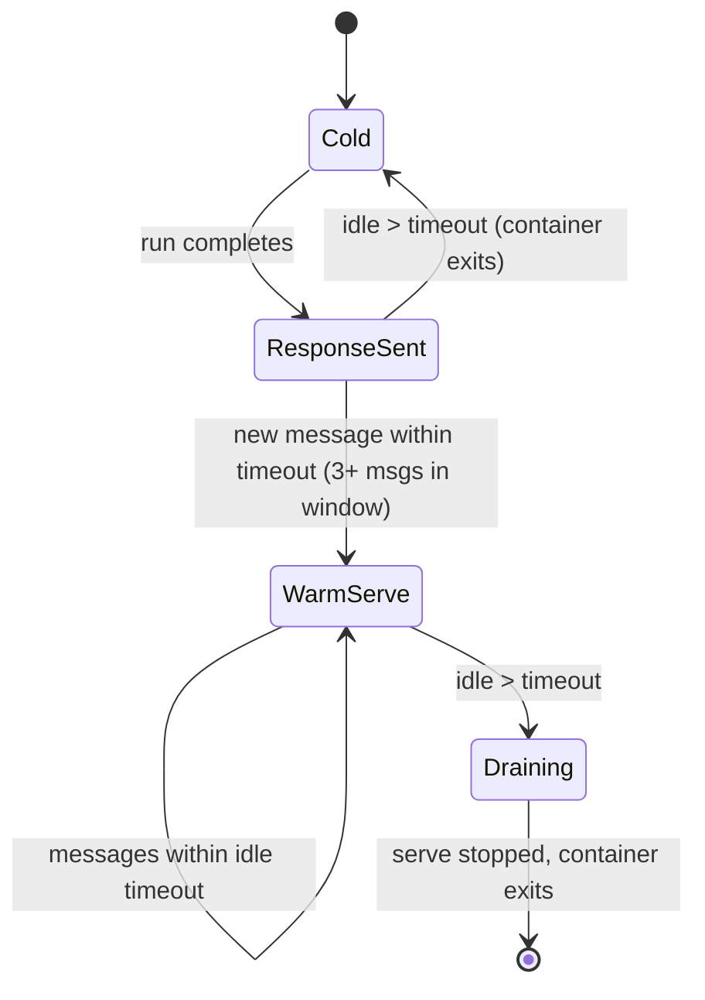

# ManaClaw OpenCode Integration

This document describes how ManaClaw uses **OpenCode** as the in-container agent runtime. It replaces the role of NanoClaw’s `SDK_DEEP_DIVE.md` (Anthropic Agent SDK) with an architecture built on OpenCode’s CLI and server modes, host orchestration, and the Model Context Protocol (MCP).

---

## 1. Why OpenCode

ManaClaw originally aligned with patterns from NanoClaw, which assumed the **Anthropic Agent SDK** as the execution engine. ManaClaw instead standardizes on **OpenCode** for these reasons:

- **Vendor independence:** OpenCode is not tied to a single model provider. The same integration surface can target local inference, OpenAI-compatible APIs, or other backends without rewriting the orchestrator’s core contract.
- **Broad provider coverage:** OpenCode supports a large and growing set of providers (on the order of **75+** in its ecosystem), which fits corporate deployments that mix on-prem models, cloud APIs, and gateways.
- **MCP as a first-class extension point:** Agents can use MCP servers (stdio, SSE, HTTP) for tools and sidecars. ManaClaw exposes its own MCP server inside the workspace container so the agent can call back into the host (scheduling, messaging, task listing) over the standard protocol.
- **Operational flexibility:** OpenCode supports **headless** invocation (`run` with stdin/stdout) and **server** mode (`serve` with HTTP), which maps cleanly to ManaClaw’s **cold** vs **warm** lifecycle without forking separate agent frameworks.

The host process remains responsible for workspace isolation, policy, persistence, and channel routing; OpenCode is the **sandboxed agent engine** inside each workspace container.

---

## 2. Runtime Modes

ManaClaw drives OpenCode in two primary modes, selected by recent activity and configurable idle behavior.

### 2.1 Cold mode (default)

On each invocation (or when no warm server is active), the host:

1. Spawns a **Docker** (or **Podman**) container for the workspace.
2. Runs OpenCode in attached, session-aware batch style:

   ```text
   opencode run --attach --session {sessionId}
   ```

3. **Writes** the user prompt (and any orchestrator-injected context) to the process **stdin**.
4. **Reads** a **JSON-lines** stream from **stdout** until the run completes and the container exits (subject to global and idle timeouts).

Cold mode favors **predictable resource usage**: no long-lived agent process inside the container between messages.

### 2.2 Warm mode (keep-alive)

When a workspace shows **sustained activity**, ManaClaw promotes that workspace to a **warm** runtime:

- **Activation heuristic:** at least **three** user or orchestrator-originated messages within the configured **idle window** (implementation aligns with `idle_timeout_ms` and related settings in `config.toml`).
- The host starts **`opencode serve`** inside the workspace container (on a configured port, e.g. `OPENCODE_PORT`).
- Subsequent turns use **HTTP** (typically **POST** with JSON body carrying message content and session id). The response may be streamed (e.g. **SSE**) and is normalized by the same parsing pipeline as stdout in cold mode.

Warm mode reduces **per-message startup cost** and suits chatty workspaces at the expense of a running container and open port until drained.

### 2.3 Lifecycle state machine

Per workspace, the runtime is modeled approximately as:



- **Cold:** No long-lived `serve`; each turn is `opencode run ...` (container may be created per invocation or reused per policy).
- **ResponseSent:** Turn finished; host waits for the next message or idle expiry.
- **WarmServe:** `opencode serve` is active; HTTP (or equivalent) is the primary path.
- **Draining:** Stop accepting new work, finish in-flight streams, tear down the server, exit the container.

Exact timeout sources include **`container_timeout_ms`** (hard ceiling for a container’s lifetime) and **`idle_timeout_ms`** (how long without traffic before cold exit or warm drain). Operators tune these for cost vs latency.

---

## 3. Per-Workspace `opencode.json` Generation

ManaClaw does **not** rely on a single global OpenCode config. For each workspace it **generates** (or regenerates) an `opencode.json` that reflects:

- Resolved **provider** and **model** from `config.toml` and any workspace overrides.
- **Permissions** aligned with PolicyEngine expectations (what the agent may do without prompting).
- **MCP servers**, including the bundled **manaclaw** server for host IPC.
- Optional **named agents** (e.g. planner) for multi-step workflows via sequential invocation rather than a proprietary “team” abstraction.

Illustrative shape:

```json
{
  "provider": { "name": "ollama", "baseUrl": "http://host.docker.internal:11434" },
  "model": "qwen2.5:14b",
  "permissions": { "edit": "auto", "bash": "auto", "webfetch": "auto" },
  "mcpServers": {
    "manaclaw": {
      "type": "stdio",
      "command": "node",
      "args": ["/workspace/mcp/manaclaw-mcp.js"]
    }
  },
  "agents": {
    "planner": { "description": "Plan complex tasks", "model": "inherit" }
  }
}
```

Paths such as `/workspace/current` (mounted workspace files) and `/workspace/mcp` (ManaClaw MCP entrypoint) are fixed in the **container image** contract so generated JSON stays portable across hosts.

---

## 4. Output Parsing

OpenCode emits a **newline-delimited JSON** stream on stdout in cold mode, and analogous **event lines** when streaming over HTTP in warm mode. ManaClaw’s **`output-parser`** module:

1. **Consumes** the stream incrementally (line by line).
2. **Classifies** each record: assistant **text**, **tool call** requests, **tool results**, **errors**, **session** metadata, **token usage**, and any vendor-specific extensions that map to internal enums.
3. **Maps** normalized events to ManaClaw **internal types** (e.g. assistant message parts, tool invocation records, failure envelopes) used by the router, channels, memory hooks, and persistence layer.
4. **Surfaces** parse failures as structured errors so channels can report a degraded response instead of silent drops.

This design keeps the orchestrator **decoupled** from OpenCode’s exact schema revisions: the parser is the single adaptation point.

---

## 5. Session Management

- **Session identity:** OpenCode returns or reinforces a **session id** in its output stream (or HTTP metadata). ManaClaw **extracts** that id on each turn.
- **Persistence:** The id is **mirrored** in the relational store (**SQLite** by default, **PostgreSQL** optional) in the workspace-scoped **sessions** table (and linked to messages / runs as defined in the schema).
- **Resume:** Subsequent invocations pass **`--session {sessionId}`** to `opencode run` (and the analogous session field in warm **POST** bodies) so conversation and tool state inside OpenCode stay continuous across container restarts as long as session storage volumes are preserved.

Host-level **session** rows are the source of truth for **correlation**, **audit**, and **UI**; OpenCode’s session is the **runtime** continuation handle.

---

## 6. Migration from Claude Agent SDK: Gaps and Compensations

NanoClaw’s Anthropic-centric path exposed rich SDK hooks and teams. ManaClaw compensates as follows:

| Claude Agent SDK capability | ManaClaw approach |
|----------------------------|-------------------|
| **Hook system** (~12 lifecycle events) | **Stream parsing** of OpenCode events, plus **PolicyEngine** gates before dangerous operations, plus **IPC** hooks on the host for tasks and control files. |
| **Agent teams** | **Sequential multi-agent invocation**: orchestrator or prompt logic runs planner / worker passes using OpenCode **`agents`** config and distinct invocations rather than a single SDK-managed team graph. |
| **`canUseTool` callbacks** | **`opencode.json` `permissions`** for coarse automation, and **PolicyEngine** for mount, command, and egress rules at the host boundary. |
| **Cost / usage tracking** | Parser extracts **token usage** (and related billing signals when present); ManaClaw persists rows in a **`token_usage`** (or equivalent) table for reporting and limits. |

The result is slightly more **host-owned** orchestration logic in exchange for **provider flexibility** and **standard MCP** tooling.

---

## 7. Container Setup

The reference image (e.g. `manaclaw-agent:latest`) is built from a slim **Node.js** base, with OpenCode installed globally and ManaClaw’s MCP bundle copied into a known path.

**Dockerfile sketch:**

```dockerfile
FROM node:22-slim
RUN npm install -g opencode
RUN mkdir -p /workspace/current /workspace/mcp /home/node/.opencode
COPY mcp/ /workspace/mcp/
USER node
WORKDIR /workspace/current
ENTRYPOINT ["opencode"]
```

At **run** time the host typically:

- Mounts the workspace directory to **`/workspace/current`**.
- Mounts persistent OpenCode state (sessions, cache) under **`/home/node/.opencode/`** (or the user-home path OpenCode expects).
- Passes **environment** for provider secrets via the **credential manager** (avoid logging raw keys).
- Applies **mount allowlists** and **blocked path patterns** before `docker run`.

The **ManaClaw MCP server** (`/workspace/mcp/manaclaw-mcp.js`) is the bridge for tools that must reach the host (scheduler, outbound messages, task visibility).

---

## 8. MCP Tools (Manaclaw Server Inside the Container)

The **manaclaw** MCP server is registered in generated `opencode.json` as a **stdio** server. It exposes tools that map to NanoClaw-style **IPC** and **scheduler** operations, for example:

| Tool (conceptual) | Purpose |
|-------------------|---------|
| **`schedule_task`** | Create or update a deferred run (cron, interval, one-shot) scoped to the current workspace. |
| **`list_tasks`** | List pending and recent tasks for the workspace. |
| **`cancel_task`** / **`pause_task`** / **`resume_task`** | Manipulate scheduled work where supported. |
| **`send_message`** | Request an outbound message on a channel (subject to host routing and allowlists). |
| **`get_workspace_info`** | Return workspace metadata the agent may need for grounding (ids, labels, limits). |
| **`report_status`** | Emit structured status for long-running work (optional, for observability). |

Exact tool names, parameters, and JSON schemas are defined in **`container/mcp/manaclaw-mcp.js`** and should stay in sync with **`docs/API.md`** and the orchestrator’s IPC contract.

---

## Related Documents

- **`docs/PRD.md`** — Product scope and OpenCode as P0 runtime.
- **`docs/API.md`** — HTTP Webhook and external integration surface.
- **`docs/SECURITY.md`** — PolicyEngine, mounts, and container trust boundaries.
- **`config.example.toml`** — Timeouts, provider defaults, and container image name.
